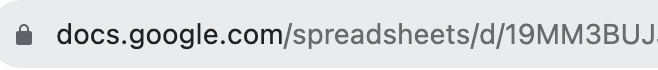
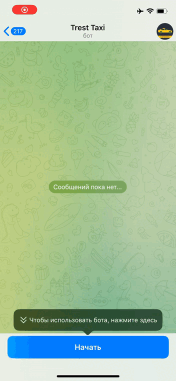
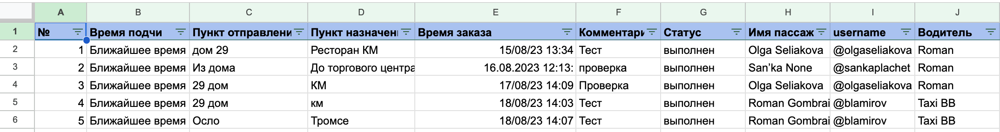

# Трест Такс

## Телеграм бот для заказа такси в городе Баренцбург

Данный бот позволяет принимать и обрабатывать заказы на такси,
Заказ и общение с пассажирами полностью проходят через данный бот, также бот выгружает все заказы в гугл таблицу 
для удобного ведения отчетности заказов.

На данный момент этот бот используется компаний ТрестАрктикУголь в самом северном городе России - Баренцбург

Данный бот имеет файл Dockerfile что дает возможность создать свой контейнер и развернуть проект на своем сервере

## Начло работы

Для начала работы нужно создать файл .env в котором прописать:
`BOT_TOKEN="your_token"`

Создать гугл таблицу и взять оттуда Spreadsheet_id:

`Spreadsheet_id= `

Spreadsheet_id - это все что находится в адресной строке начина после /d/ и заканчивая следующим слешем,
в нашем случае Spreadsheet_id будет начинаться с `19MM3B...`

Токен можно получить через бот Botfather

Также нужно получить документ creds.json для работа с google API и импортировать его в проект в папку data_base_doc

После чего запустить main.py и бот готов.

## Процесс заказа такси

Клиент начинает свое общение с ботом с нажатия кнопки start 
далее выводится небольшой текст с дальнейшими инструкциями 
после чего можно нажать на меню бота и сделать первый заказ.

После подтверждения заказа от таксиста, пользователь может в меню изменить заказ (отменить, изменить точки 
отправления/назначения, изменить время)

## Заказ со стороны водителя

Для того чтобы заявки поступали на аккаунт водителя, нужно ввести в телеграм боте /idriver, после этого водитель 
получит уведомление о том что он подключен к рассылке на заказы.

После подтверждения заказа водитель может посмотреть свои активные заказы, подтвердить выполнение или отменить 
заказа в случае непредвиденной ситуации.

Для общения водителя и клиента, вместе с заказом обоим приходят с сообщением username из телеграма, но не у 
каждого пользователя они есть. Поэтому реализована дополнительная команда для водителя, благодаря которой можно 
общаться с пользователем через телеграм бот. У водителя должен быть username для удобного контакта с пользователем.

## Сбор данных

После подтверждения выполнения заказа или при его отмене, вся информация будет передана в гугл таблицу, ссылка на 
которую была указана в Spreadsheet_id

